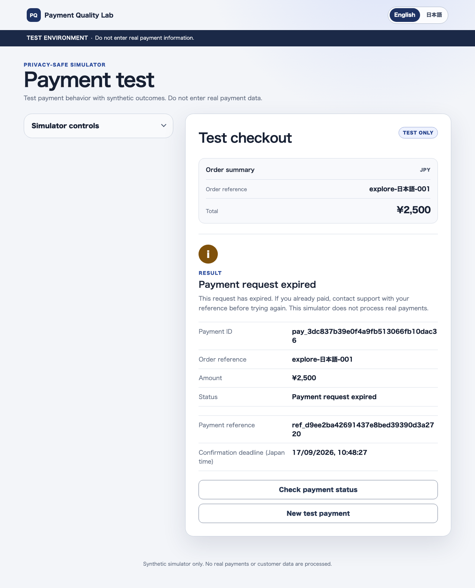
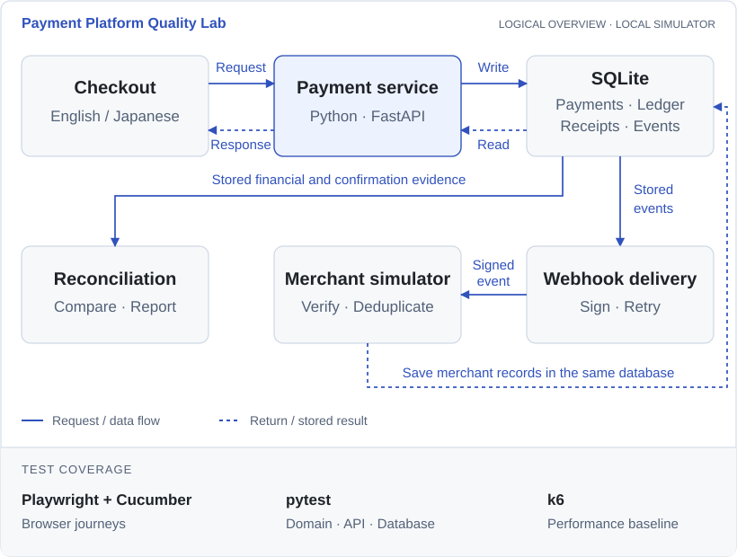

<p align="center">
  
</p>

# Payment Platform Quality Lab

Payment Platform Quality Lab is a privacy-safe payment simulator and QA
portfolio project. It demonstrates risk-based testing of payment lifecycles,
failure recovery, financial correctness, and platform reliability without
processing real payments or cardholder data.

[](tests/) [](features/) [](features/checkout/) [](LICENSE)

<p align="center">
  <a href="docs/quality/enhancements/e2-asynchronous-payment-confirmation/evidence/en-desktop.png">
    
  </a>
</p>

## Project goals

- Model synchronous authorization and asynchronous confirmation, plus capture,
  cancellation, decline, and refund behavior.
- Prevent duplicate financial effects through idempotency controls.
- Exercise signed webhooks, duplicate delivery, retries, and out-of-order events.
- Verify monetary precision for USD and zero-decimal JPY transactions.
- Reconcile API state, immutable ledger entries, webhook history, and settlement
  records.
- Combine unit, API, integration, browser, exploratory, regression, and
  performance testing.
- Demonstrate release-quality evidence through CI reports and explicit gates.

## System design

The system under test is a small Python payment service with a responsive,
provider-neutral English/Japanese checkout. The service uses integer minor units, an explicit
payment state machine, an immutable ledger, idempotency claims with immutable
response snapshots, optimistic concurrency control, a transactional webhook
outbox, and multi-source financial reconciliation.

[](docs/assets/payment-architecture.svg)

Logical components, not separate deployments. Merchant delivery is simulated
in-process; no real payment provider is connected.

Test tooling:

- pytest for domain, API, database, webhook, and reconciliation testing.
- FastAPI TestClient for service-level HTTP checks.
- Node's built-in test runner for browser-side money, UI-state, derived-view,
  decline-guidance, and design-token contrast rules.
- Cucumber-JS for business-readable Gherkin scenarios and scenario reports.
- TypeScript Playwright for Chromium control, isolated contexts, mobile and
  keyboard actions, network routing, screenshots, and traces.
- Hypothesis for financial and state-machine invariants.
- Grafana k6 OSS v2.0.0 for isolated performance and reliability profiles.
- Ruff and branch-aware coverage for fast feedback.
- GitHub Actions for Python, Chromium, automatic performance checkpoints, and
  retained test evidence.

## Delivery milestones

1. Project foundation, requirements, and risk-based test plan
2. Authorization vertical slice with persistence and CI
3. Payment lifecycle and financial invariants
4. Idempotency, ledger correctness, concurrency, and failure injection
5. Webhook delivery, consumption, and reconciliation
6. English/Japanese checkout with TypeScript Playwright and Cucumber-JS
7. Structured exploratory testing, cross-layer diagnosis, and defect evidence
8. Performance baseline and portfolio-ready reporting

## Current status

The service supports authorization, capture, cancellation, partial and full refunds, and delayed-payment confirmation. Six decline reasons share one `DECLINED` state. Declined payments have zero financial balances and no ledger entry. Invalid actions and excessive refunds leave financial records unchanged.

The recorded automated baseline includes 397 Python tests, 49 JavaScript tests, and 18 Cucumber browser scenarios with 140 steps. Python coverage exceeds the required 85% gate. GitHub Actions runs the Python tests on versions 3.12 and 3.14, with browser tests in Chromium.

Idempotency keys protect against duplicate payment actions. Repeating an identical request returns its original result, while reusing the key with different details returns a conflict. Tests cover competing requests and timeouts before and after a payment is saved.

Each accepted payment version creates one signed webhook event alongside the payment change. Delivery supports retries, and the merchant simulator checks signatures, ignores safe duplicates, and prevents older events from replacing newer records.

Reconciliation compares settlement data, payment balances, ledger entries, and merchant records without changing financial records. JPY and USD totals stay separate. The confirmation section is saved once per batch; current financial checks run again. A new batch is required for fresh confirmation evidence.

The responsive English/Japanese checkout separates simulator controls from the customer payment area. It shows an order summary, exact currency amounts, and clear results. Safe retry and page-reload recovery preserve uncertain outcomes without storing raw payment tokens in browser storage.

Browser tests cover approvals, declines, validation, Japanese input, repeated submission, timeout recovery, keyboard use, and mobile layouts. Failed scenarios retain screenshots and traces. Exploratory testing also found and helped resolve a defect where page refresh hid a payment that had already been saved.

The k6 performance suite covers authorization, retrieval, repeated requests, and mixed traffic. A separate Python check verifies financial records after each run. Milestone 8 recorded two complete passing baselines and one blocked response-time failure, with evidence preserved in its quality report. These workloads cover synchronous payments.

Delayed payments begin in `AWAITING_PAYMENT` with a unique reference and a 72-hour deadline, without creating a ledger entry. A valid, matching confirmation received before the deadline authorizes and captures the amount together. Late, mismatched, unknown, duplicate, and already-resolved confirmations are recorded without an unintended financial effect.

Saved confirmation receipts survive processing failures and support safe recovery. Tests force confirmation, expiry, and cancellation to compete and verify one valid outcome. The checkout can refresh the backend status without creating another payment; browser time alone cannot confirm or expire it. The E2 closing report records the results and remaining limits.

## Quick start

Python 3.12 or newer is required.

```bash
python3 -m venv .venv
source .venv/bin/activate
python -m pip install --editable '.[dev]'
python -m pytest
```

Start the service:

```bash
payment-quality-lab-migrate
payment-quality-lab
```

The migration command creates a new database or upgrades a known older local
schema without deleting its payment evidence. Service startup checks the schema
revision and stops with an actionable message if migration is still required.
For another database location, set `PAYMENT_LAB_DATABASE_URL` for both commands.

The API documentation is then available at
<http://127.0.0.1:8000/docs>.

The synthetic checkout is available at:

- <http://127.0.0.1:8000/checkout?lang=en>
- <http://127.0.0.1:8000/checkout?lang=ja>

Node 22, 24, or 26 and newer releases are supported by the browser test stack.
Install Chromium and run the complete browser gate:

```bash
npm ci
npx playwright install chromium
npm run test:browser
```

The complete browser gate runs these commands in order:

```bash
npm run test:unit
npm run typecheck
npm run test:acceptance
```

Grafana k6 OSS v2.0.0 is required for the performance harness. Run the short
profile after installing that exact version:

```bash
python scripts/run_performance.py smoke
```

The measured profile names are `authorization`, `retrieval`,
`idempotent-burst`, and `mixed`. Every run creates its own loopback application
and temporary database. See the
[Milestone 8 implementation guide](docs/quality/milestones/m8-performance-baseline/implementation-guide.md)
for workloads, commands, evidence fields, safety controls, and limitations.

The performance workflow is available on `main`. Use its **Run workflow**
button to select one profile or `all`. Relevant pull requests run `smoke`
automatically. The weekly workflow runs the complete set without delaying every
code review.

Running `python -m pytest` shows results in the terminal. It does not create
the XML reports below by default. CI adds the test and coverage report options.

Generated reports are local or temporary CI evidence and are not committed:

- `reports/junit.xml` and `reports/coverage.xml` for pytest;
- `reports/cucumber/cucumber-report.html` for a readable scenario report;
- `reports/cucumber/cucumber-report.json` for later analysis;
- `reports/cucumber/cucumber-junit.xml` for CI integration; and
- `reports/browser/` for sanitized failure screenshots and traces;
- `reports/performance/*/*/k6-summary.json` for selected performance metrics;
  and
- `reports/performance/*/*/financial-verification.json` for exact post-load
  financial checks.

GitHub Actions keeps Python, browser, and performance evidence for 14 days.
Human-readable milestone decisions remain under `docs/quality/` so a reviewer
can understand the risks, results, defects, and limitations without downloading
CI artifacts.

## Known limits

- **Simulator only:** Uses synthetic data, processes no real payments, and does not verify a real payment-provider integration.
- **Local operation:** Database concurrency is tested with SQLite. Expiry and recovery require explicit operations, not an automatic background worker.
- **Production security:** Internal endpoints lack production access controls. No production readiness or payment-security certification is claimed.
- **Interface coverage:** Browser automation covers Chromium and simulated mobile sizes. Accessibility checks are partial.
- **Performance scope:** Performance tests cover synchronous payments, not delayed-payment capacity.

See the [E2 closing report](docs/quality/enhancements/e2-asynchronous-payment-confirmation/closing-report.md)
and [fresh-clone verification](docs/quality/fresh-clone-verification.md) for
recorded results and environment limits. Test counts describe the tested build,
not a promise that every possible problem has been covered.

## API examples

Create a synthetic JPY authorization:

```bash
curl --request POST http://127.0.0.1:8000/payments \
  --header 'Content-Type: application/json' \
  --header 'Idempotency-Key: demo-order-0001' \
  --data '{
    "merchant_reference": "order-2026-0001",
    "amount": 2500,
    "currency": "JPY",
    "payment_method_token": "tok_approved"
  }'
```

Only deterministic synthetic tokens are accepted:

- `tok_approved` creates an authorized payment and authorization ledger entry.
- `tok_declined_insufficient_funds` stores `insufficient_funds`.
- `tok_declined_limit_exceeded` stores `limit_exceeded`.
- `tok_declined_expired` stores `expired_payment_method`.
- `tok_declined_verification` stores `verification_failed`.
- `tok_declined_invalid` stores `invalid_payment_method`.
- `tok_declined_unknown` stores the safe `unknown` fallback.
- Legacy `tok_declined` remains an API alias for `unknown`.
- `tok_awaiting_confirmation` creates a payment reference and 72-hour deadline
  without creating a financial ledger effect.

Every decline creates no financial ledger effect. These strings are simulator
controls, not real payment credentials, and are not retained in payment,
webhook, browser-storage, or report evidence.

After authorization, use the returned payment ID for lifecycle operations:

```bash
curl --request POST http://127.0.0.1:8000/payments/PAYMENT_ID/capture \
  --header 'Idempotency-Key: demo-capture-0001'

curl --request POST http://127.0.0.1:8000/payments/PAYMENT_ID/refund \
  --header 'Content-Type: application/json' \
  --header 'Idempotency-Key: demo-refund-0001' \
  --data '{"amount": 1000}'
```

Use `/payments/PAYMENT_ID/cancel` instead of capture to cancel an authorized
payment. Capture and cancellation are mutually exclusive in the state machine.

Awaiting requests can also be cancelled, without a ledger entry. A matching
on-time pending confirmation blocks cancellation with `confirmation_pending`
(409). Passing the deadline alone does not expire a payment: cancellation and
explicit expiry follow their committed database order. See the
[cancellation quality report](docs/quality/enhancements/e2-asynchronous-payment-confirmation/cancellation-report.md).

See:

- [Payment requirements](docs/payment-requirements.md)
- [Payment lifecycle](docs/payment-lifecycle.md)
- [Idempotency and failure recovery](docs/payment-reliability.md)
- [Webhook delivery and consumption](docs/webhook-delivery.md)
- [Settlement and reconciliation](docs/reconciliation.md)
- [Database migrations](docs/database-migrations.md)
- [Risk-based test plan](docs/test-plan.md)
- [Quality evidence and milestone reports](docs/quality/README.md)
- [Final project quality summary](docs/quality/project-summary.md)
- [Milestone 6 checkout quality report](docs/quality/milestones/m6-multilingual-checkout/quality-report.md)
- [Milestone 7 exploratory charter](docs/quality/milestones/m7-exploratory-testing/exploratory-charter.md)
- [Milestone 7 session record](docs/quality/milestones/m7-exploratory-testing/session-record.md)
- [Milestone 7 quality report](docs/quality/milestones/m7-exploratory-testing/quality-report.md)
- [Milestone 8 performance scenario catalog](docs/quality/milestones/m8-performance-baseline/scenario-catalog.md)
- [Milestone 8 performance implementation guide](docs/quality/milestones/m8-performance-baseline/implementation-guide.md)
- [Milestone 8 performance quality report](docs/quality/milestones/m8-performance-baseline/quality-report.md)
- [Milestone 8 sanitized example summary](docs/quality/milestones/m8-performance-baseline/example-summary.json)
- [Enhancement 1 detailed decline scenario catalog](docs/quality/enhancements/e1-detailed-decline-outcomes/scenario-catalog.md)
- [Enhancement 1 exploratory session](docs/quality/enhancements/e1-detailed-decline-outcomes/exploratory-session.md)
- [Enhancement 1 quality report](docs/quality/enhancements/e1-detailed-decline-outcomes/quality-report.md)
- [UX-01 checkout experience scenario catalog](docs/quality/enhancements/ux1-checkout-experience/scenario-catalog.md)
- [UX-01 exploratory session](docs/quality/enhancements/ux1-checkout-experience/exploratory-session.md)
- [UX-01 quality report](docs/quality/enhancements/ux1-checkout-experience/quality-report.md)
- [Enhancement 2 asynchronous confirmation scenario catalog](docs/quality/enhancements/e2-asynchronous-payment-confirmation/scenario-catalog.md)
- [Enhancement 2 database migration foundation report](docs/quality/enhancements/e2-asynchronous-payment-confirmation/migration-foundation-report.md)
- [Enhancement 2 confirmation processing report](docs/quality/enhancements/e2-asynchronous-payment-confirmation/confirmation-processing-report.md)
- [Enhancement 2 scheduled expiry report](docs/quality/enhancements/e2-asynchronous-payment-confirmation/scheduled-expiry-report.md)
- [Enhancement 2 race and recovery report](docs/quality/enhancements/e2-asynchronous-payment-confirmation/race-resolution-report.md)
- [Defect reports](docs/defects/)

## License

This project is available under the [MIT License](LICENSE).
