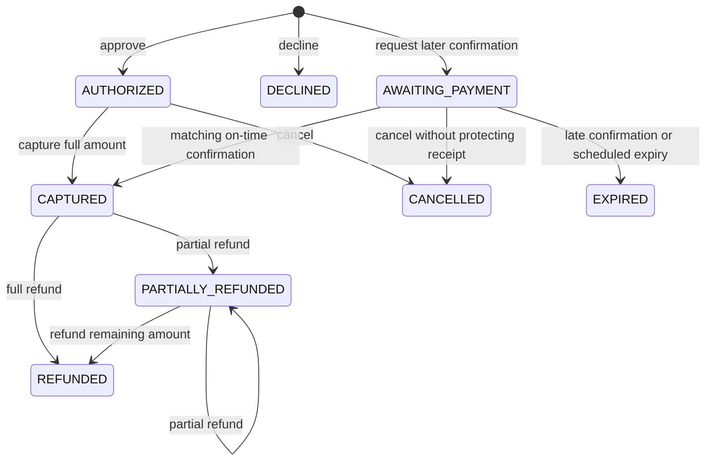

# Payment Lifecycle

## State model

The simulator uses an explicit, full-capture payment state machine. Any
transition not shown below is rejected without changing payment, ledger, or
idempotency state.

Partial capture is outside the implemented scope. Awaiting cancellation creates
no ledger entry. A matching on-time pending receipt blocks cancellation with
`confirmation_pending` (409). Passing the deadline alone does not block it:
cancellation and explicit expiry use the same SQLite writer ordering, and the
first committed terminal transition wins. See the
[cancellation report](quality/enhancements/e2-asynchronous-payment-confirmation/cancellation-report.md).

## Decline reasons

`DECLINED` remains one final lifecycle state. The payment stores one separate
provider-neutral reason so investigation and customer guidance do not require a
larger state machine:

| Reason | Customer action |
|---|---|
| `insufficient_funds` | Check available funds or try another payment method |
| `limit_exceeded` | Use a permitted amount or another payment method |
| `expired_payment_method` | Update the payment method or use another one |
| `verification_failed` | Check the submitted information and try again |
| `invalid_payment_method` | Check or replace the payment method |
| `unknown` | Try again later or use another payment method |

A declined payment must have one recognized reason. An authorized or later
lifecycle state must have no decline reason. The fresh database schema enforces
that relationship. The legacy `tok_declined` input remains an alias for
`unknown`, while the checkout uses the six detailed controls.

## API operations

| Operation | Endpoint | Request body | Accepted starting state |
|---|---|---|---|
| Authorize | `POST /payments` | Merchant reference, amount, currency, synthetic token | New request |
| Capture | `POST /payments/{id}/capture` | None | `AUTHORIZED` |
| Cancel | `POST /payments/{id}/cancel` | None | `AUTHORIZED`, or `AWAITING_PAYMENT` without a protecting receipt |
| Refund | `POST /payments/{id}/refund` | Positive integer `amount` | `CAPTURED`, `PARTIALLY_REFUNDED` |
| Confirm delayed payment | `POST /payment-confirmations` | Confirmation ID, reference, amount, currency | Signed inbound request |
| Inspect confirmation | `GET /internal/payment-confirmations/{confirmation_id}` | None | Internal diagnostic use |
| Expire overdue delayed payments | Internal `expire_due_payments(now)` service operation | Trusted UTC time and bounded batch limit | `AWAITING_PAYMENT` at or after deadline |

Client-directed lifecycle requests require an `Idempotency-Key` header. Equivalent
retries create no additional ledger effect or payment version. Reusing a key for
a different payment, operation, or amount returns an idempotency conflict.
The first accepted request stores an immutable response snapshot; later retries
return that snapshot rather than the payment's current mutable state.

Inbound delayed-payment confirmations use `Confirmation-Signature` plus their
own stable `confirmation_id`. Identical confirmation replay returns the original
safe acknowledgement. Conflicting content under the same ID returns `409`.

Scheduled expiry uses the same transition as a late confirmation. It processes
at most 100 payments by default, ordered by deadline and then payment ID. One
bounded batch commits or rolls back as a unit. Repeating the operation does not
change an already expired payment or create another lifecycle event.

Matching on-time pending receipts protect awaiting payments from expiry. A
receipt is committed before financial processing. Completion, caller retry,
internal recovery, and expiry coordinate through the SQLite writer reservation.
Final processing failure preserves the pending receipt and rolls back the
financial transaction. See the [race and recovery report](quality/enhancements/e2-asynchronous-payment-confirmation/race-resolution-report.md)
for the acceptance-time definition and internal recovery example.

## Financial invariants

The domain layer and fresh database schema both enforce:

- monetary values are integer minor units;
- `0 <= captured_amount <= authorized_amount`;
- `0 <= refunded_amount <= captured_amount`;
- capture uses the full authorized amount;
- cumulative refunds never exceed captured funds;
- accepted lifecycle operations increment the version exactly once;
- stale writers cannot overwrite a newer payment version;
- rejected operations leave the aggregate unchanged.

Hypothesis generates valid authorization and refund amounts to exercise these
properties beyond the enumerated boundary examples.

## Ledger semantics

Ledger entries are append-only through the public service API:

| Entry | Meaning | Amount |
|---|---|---|
| `AUTHORIZATION` | Approved reservation | Authorized amount |
| `CAPTURE` | Reservation captured | Full authorized amount |
| `CANCEL` | Reservation cancelled before capture | Authorized amount |
| `REFUND` | Captured funds returned | Requested refund amount |
| `CONFIRMATION_CAPTURE` | Delayed funds confirmed and captured atomically | Confirmed amount |

The operation determines the accounting direction; all stored amounts remain
positive integer minor units. Reconciliation uses these operations to calculate
financial totals. `CONFIRMATION_CAPTURE` contributes to both authorized and
captured totals in one payment change. Awaiting creation, awaiting cancellation,
and expiry do not create ledger entries.

## Error behavior

- Unknown payment IDs return `404 payment_not_found`.
- Reusing an idempotency key for a different request returns
  `409 idempotency_conflict`.
- Invalid state transitions return `409 invalid_payment_transition`.
- Refunds above the remaining captured balance return
  `409 refund_amount_exceeded` with requested and refundable amounts.
- Invalid request shapes and non-positive amounts return `422` before the
  service changes state.
