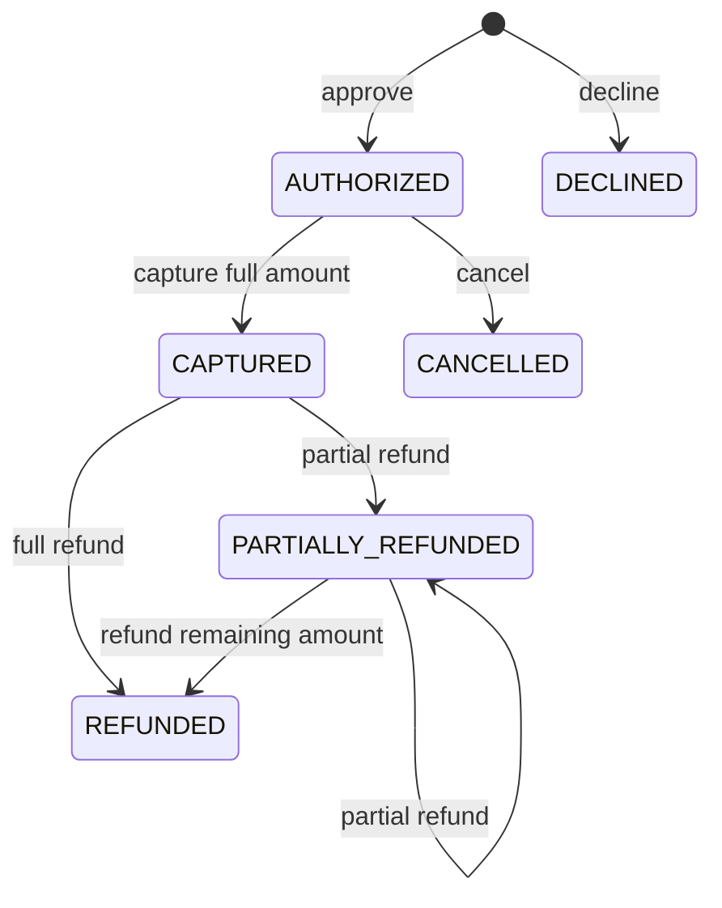

# Payment Lifecycle

## State model

The simulator uses an explicit, full-capture payment state machine. Any
transition not shown below is rejected without changing payment, ledger, or
idempotency state.

Partial capture and authorization expiry are outside the current scope.

## API operations

| Operation | Endpoint | Request body | Accepted starting state |
|---|---|---|---|
| Authorize | `POST /payments` | Merchant reference, amount, currency, synthetic token | New request |
| Capture | `POST /payments/{id}/capture` | None | `AUTHORIZED` |
| Cancel | `POST /payments/{id}/cancel` | None | `AUTHORIZED` |
| Refund | `POST /payments/{id}/refund` | Positive integer `amount` | `CAPTURED`, `PARTIALLY_REFUNDED` |

Every state-changing request requires an `Idempotency-Key` header. Equivalent
retries create no additional ledger effect or payment version. Reusing a key for
a different payment, operation, or amount returns an idempotency conflict.
The first accepted request stores an immutable response snapshot; later retries
return that snapshot rather than the payment's current mutable state.

## Financial invariants

The domain layer and fresh database schema both enforce:

- monetary values are integer minor units;
- `0 <= captured_amount <= authorized_amount`;
- `0 <= refunded_amount <= captured_amount`;
- capture uses the full authorized amount;
- cumulative refunds never exceed captured funds;
- accepted lifecycle operations increment the version exactly once;
- stale writers cannot overwrite a newer payment version;
- rejected operations leave the aggregate unchanged.

Hypothesis generates valid authorization and refund amounts to exercise these
properties beyond the enumerated boundary examples.

## Ledger semantics

Ledger entries are append-only through the public service API:

| Entry | Meaning | Amount |
|---|---|---|
| `AUTHORIZATION` | Approved reservation | Authorized amount |
| `CAPTURE` | Reservation captured | Full authorized amount |
| `CANCEL` | Reservation cancelled before capture | Authorized amount |
| `REFUND` | Captured funds returned | Requested refund amount |

The operation determines the accounting direction; all stored amounts remain
positive integer minor units. Reconciliation will interpret these operations in
a later milestone.

## Error behavior

- Unknown payment IDs return `404 payment_not_found`.
- Reusing an idempotency key for a different request returns
  `409 idempotency_conflict`.
- Invalid state transitions return `409 invalid_payment_transition`.
- Refunds above the remaining captured balance return
  `409 refund_amount_exceeded` with requested and refundable amounts.
- Invalid request shapes and non-positive amounts return `422` before the
  service changes state.
